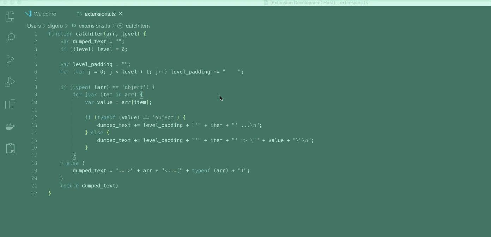

# Synonym Finder
Simply Synonym Finder

## Features
1. Choose the word you want to find synonyms.
2. Open the command palette (`shift + command + p` or `shift + ctrl + p`)
3. Enter "Find Synonym".
4. Select the wanted word from the synonym list.

## Synonym API Source
https://www.datamuse.com/api